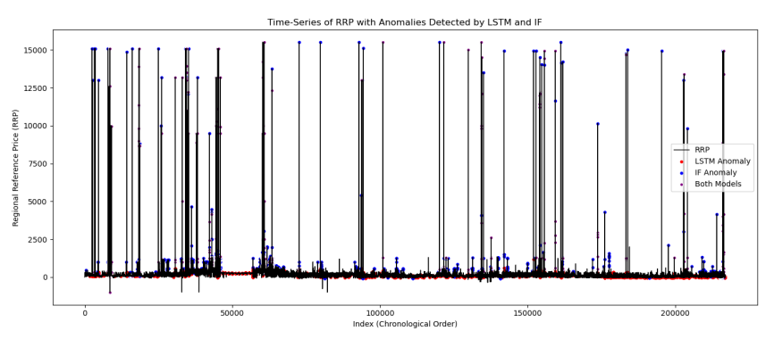
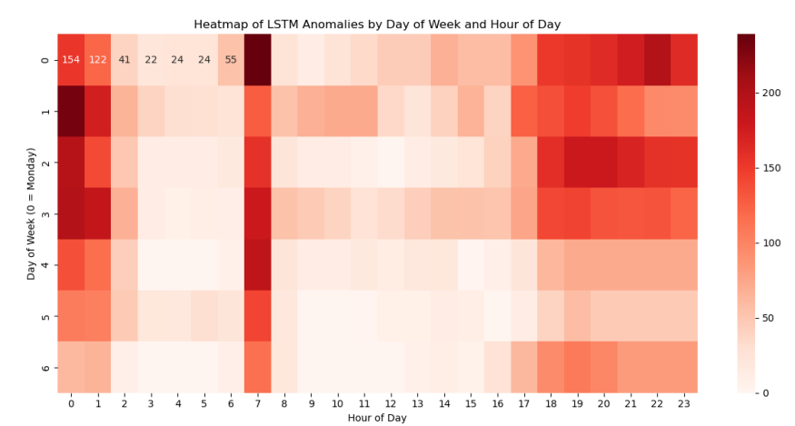
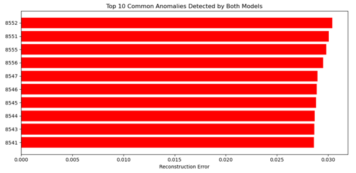

# Electricity Price Anomaly Detection: NEM Queensland

> Unsupervised anomaly detection on Queensland's National Electricity Market wholesale price data, combining a classical and a deep learning approach and checking where they actually agree.

QUT Minor Project (IFN695), February to June 2025.

---

## 📌 The Problem

Electricity prices on Australia's National Electricity Market can spike or behave erratically for reasons that aren't always obvious from the price series alone. This project builds a dual-model pipeline to flag those irregular periods in Queensland's market, and, instead of trusting one method, checks whether a purely statistical approach and a purely learned approach actually agree on what looks unusual.

Two complementary techniques run side by side:

- **Isolation Forest**: flags anomalies based on how easily a point can be isolated in feature space, no notion of time order
- **LSTM Autoencoder**: learns to reconstruct normal 96-step price sequences (one day at 15-minute resolution), then flags the ones it reconstructs badly

## 📊 The Data

- Australian Energy Market Operator (AEMO) dispatch and trading price data, 2022 to 2024
- Bureau of Meteorology weather records for the same period, merged in
- 220,000+ half-hourly records after merging and cleaning
- 13 engineered features: lagged price, percentage price change, demand forecast error, hour-of-day and day-of-week, plus temperature, solar radiation and rainfall

## 🔍 Methodology

- Feature scaling with `MinMaxScaler` across all 13 engineered features
- **Isolation Forest**: 100 estimators, contamination set to 2%, trained on the full scaled feature set
- **LSTM Autoencoder**: 96-step sliding windows, a 64-unit LSTM encoder/decoder with a `RepeatVector` bottleneck, trained to minimise reconstruction MSE; anomalies flagged above the 95th percentile of reconstruction error
- Results from both models joined on the same timestamps to compare agreement, not just each model scored in isolation

## 📈 Results

Across the full 2022 to 2024 series, price spikes cluster into distinct episodes rather than spreading evenly through time, and both models generally light up around the same episodes even though they were trained completely differently.

Breaking those anomalies down by time of day shows they aren't random either. 7am is the single most anomalous hour of the day, every day of the week, with the very early hours (midnight to 1am) also elevated. The middle of the day, 8am to 4pm, is comparatively quiet, pointing to anomalies clustering around morning demand ramp-up rather than being scattered noise.

Plotting price against temperature shows anomalies concentrating at the temperature extremes, both the high 30s and the milder-but-still-elevated 20 to 30°C band, consistent with heatwave-driven demand spikes rather than cold-weather effects.

The LSTM Autoencoder flagged 10,852 points (its top 5% by reconstruction error); Isolation Forest flagged 4,343 (its fixed 2% contamination rate). The two models agreed on 1,563 anomalies, meaning over a third of everything Isolation Forest flagged, the LSTM independently flagged too, despite the two methods having no shared assumptions about what "normal" looks like.

The ten anomalies both models rank most confidently sit at nearly consecutive dataset indices, a single sustained event the models agree on, rather than scattered one-off spikes.

Looking at what actually separates those agreed-upon anomalies from normal periods: `TOTALDEMAND` and `demand_error` deviate the most, followed by `DISPATCHABLEGENERATION` and lagged price. Weather variables (temperature, solar radiation, rainfall) barely move the needle directly, their effect shows up indirectly, through the demand and generation figures they drive.

## 💡 Takeaway

The two models agreeing on 1,563 specific anomalies, concentrated around a handful of demand-driven episodes rather than spread randomly through the dataset, is the real finding here: it's evidence those price spikes reflect genuine market stress (demand and generation shortfalls) rather than statistical noise that only one method happened to notice.

## 🛠️ Tech Stack

| Technology | Purpose |
|---|---|
| Python | Core language |
| Pandas / NumPy | Data merging, cleaning, feature engineering |
| scikit-learn | Isolation Forest, `MinMaxScaler` |
| TensorFlow / Keras | LSTM Autoencoder |
| Matplotlib | All result visualisations |

## 📁 Files

- [`N11736089_VarunVikasJaiswal_IFN695.ipynb`](N11736089_VarunVikasJaiswal_IFN695.ipynb): full analysis notebook
- [`Detecting and Understanding Electricity FINAL REPORT .pdf`](Detecting%20and%20Understanding%20Electricity%20FINAL%20REPORT%20.pdf): full written report

---

**Author:** Varun Vikas Jaiswal (QUT, 2025)
