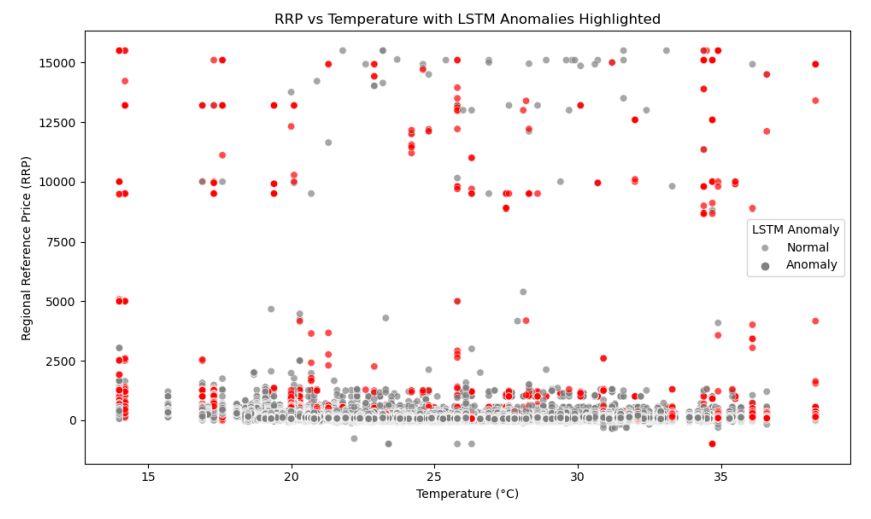
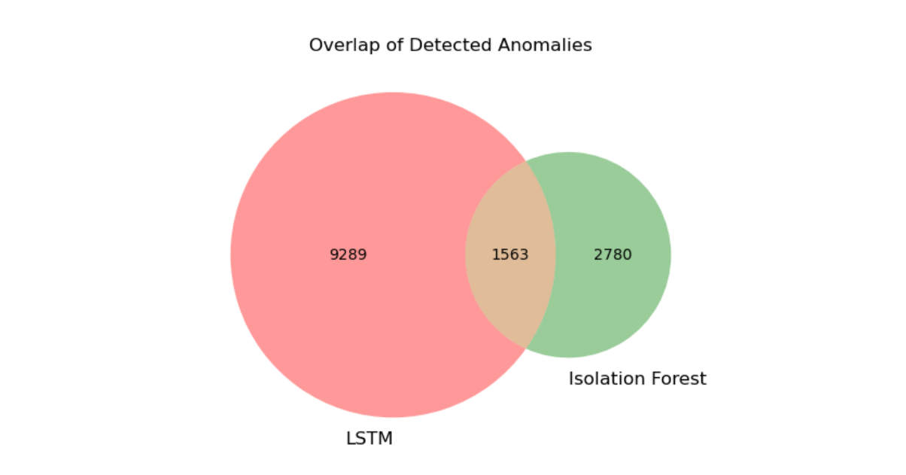
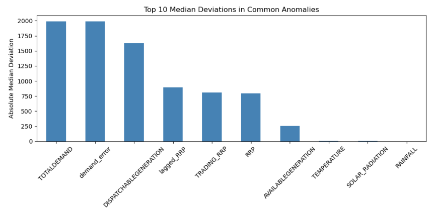

# Electricity Price Anomaly Detection — NEM Queensland

> Unsupervised anomaly detection on Queensland's National Electricity Market wholesale price data, combining a classical and a deep learning approach and comparing where they agree.

QUT Minor Project (IFN695), February to June 2025.

---

## 📌 Overview

Electricity prices on Australia's National Electricity Market can spike or behave erratically for reasons that aren't always obvious from the price series alone. This project builds a dual-model pipeline to flag those irregular periods in Queensland's market and checks whether a purely statistical method and a purely learned method actually agree on what looks unusual.

Two complementary techniques are used side by side rather than picking one:

- **Isolation Forest** — flags anomalies based on how easily a point can be isolated in feature space, with no notion of time order.
- **LSTM Autoencoder** — learns to reconstruct normal 96-step price sequences, then flags the ones it reconstructs badly.

## 📊 Dataset

- Australian Energy Market Operator (AEMO) dispatch and trading price data, 2022 to 2024
- Bureau of Meteorology weather records for the same period, merged in
- 220,000+ half-hourly records after merging and cleaning
- 13 engineered features: lagged price, percentage price change, demand forecast error, hour-of-day and day-of-week, plus temperature, solar radiation and rainfall

## 🔍 Methodology

- Feature scaling with `MinMaxScaler` across all 13 engineered features
- **Isolation Forest**: 100 estimators, contamination set to 2%, trained on the full scaled feature set
- **LSTM Autoencoder**: 96-step sliding windows (one day at 15-minute resolution), a 64-unit LSTM encoder/decoder with a `RepeatVector` bottleneck, trained to minimise reconstruction MSE; anomalies flagged above the 95th percentile of reconstruction error
- Results from both models joined on the same timestamps to compare agreement, not just each model in isolation

## 📈 Results

The LSTM Autoencoder flagged 10,852 points as anomalous (its top 5% by reconstruction error); Isolation Forest flagged 4,343 (its fixed 2% contamination rate). The two models agreed on 1,563 anomalies.

Comparing feature medians between the anomalies both models agree on and normal periods, `TOTALDEMAND` and `demand_error` show the largest deviation, followed by `DISPATCHABLEGENERATION` and lagged price. Temperature also correlates with where anomalies cluster, visible in the scatter plot above.

## 🛠️ Tech Stack

| Technology | Purpose |
|---|---|
| Python | Core language |
| Pandas / NumPy | Data merging, cleaning, feature engineering |
| scikit-learn | Isolation Forest, `MinMaxScaler` |
| TensorFlow / Keras | LSTM Autoencoder |
| Matplotlib | All result visualisations |

## 📁 Files

- [`N11736089_VarunVikasJaiswal_IFN695.ipynb`](N11736089_VarunVikasJaiswal_IFN695.ipynb) — full analysis notebook
- [`N11736089_VarunVikasJaiswal_IFN695.pdf`](N11736089_VarunVikasJaiswal_IFN695.pdf) — exported report

---

**Author:** Varun Vikas Jaiswal (QUT, 2025)
